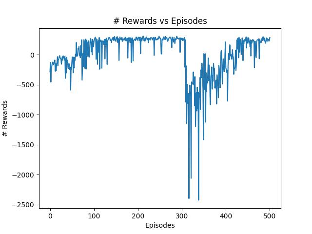
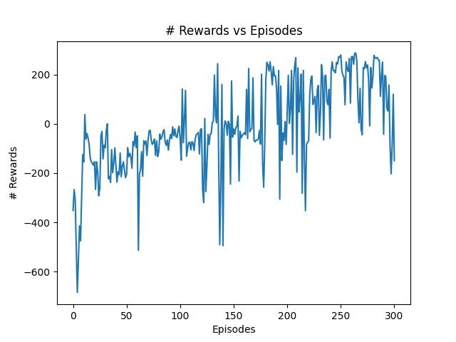
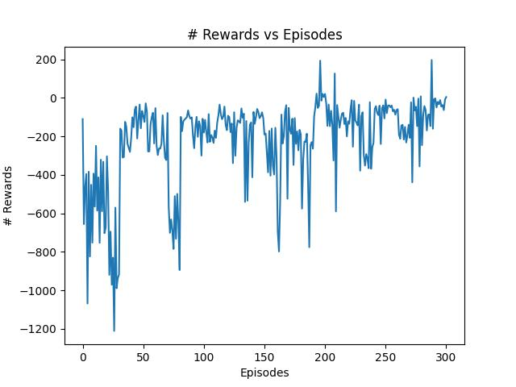
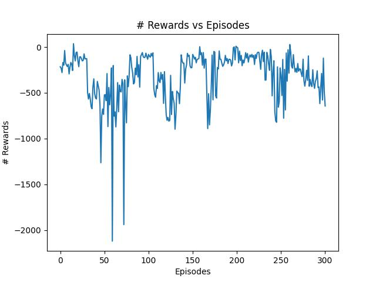

# LunarLander - Deep Q-Learning e Double Deep Q-Learning (Open AI - Gym)

**Antonio Fuziy**

**Prof: Fabrício Barth**

Esse documento apresenta uma explicação e algumas comparações entre dois modelos de reinforcement learning, o Deep Q-Learning e o Double Deep Q-Leaning. 

Primeiramente o Deep Q-Learning foi criado pela DeepMind com o objetivo de otimizar a solução do algoritmo de aprendizagem por reforço chamado de Q-Learning, e para isso utilizou-se uma rede neural ao invés de uma Q-Table para a realização da aprendizagem por reforço do agente. Dessa forma foi constatado alguns resultados mais efetivos no comportamento de agentes de reinforcement learning. Ao passo em que o Double Deep Q-Learning utiliza de duas redes neurais para o treinamento do agente, dessa forma, algumas comparações são feitas entre esses dois algoritmos ao longo desse documento.

- ### Deep Q-Learning

Utilizando-se uma implementação do Deep Q-Learning a partir de uma rede neural atuante sobre um foguete que tem como objetivo pousar em um planeta de forma autônoma, para isso utilizou-se o ambiente da Gym da OpenAI com a interface do Lunar Lander. 

```python
import gym
env = gym.make("LunarLander-v2")
```

Além disso, seguem algumas especificações sobre os parâmetros utilizados no Deep Q-Learning e na rede neural junto também do número de episódios, ambos destacados nos comentários:

```python
#model = rede neural
model = Sequential()
model.add(Dense(512, activation=relu, input_dim=env.observation_space.shape[0]))
model.add(Dense(256, activation=relu))
model.add(Dense(env.action_space.n, activation=linear))
model.summary()
model.compile(loss='mse', optimizer=Adam(learning_rate=0.001))

#parametros do Deep Q-Learning
gamma = 0.99 
epsilon = 1.0
epsilon_min = 0.01
epsilon_dec = 0.99
batch_size = 64
memory = deque(maxlen=500000) 

#numero de episodios utilizados no treino
episodes = 500
```

A partir da implementação utilizada do Deep Q-Learning acima para o agente do Lunar Lander obteve-se alguns resultados sobre o aprendizado do modelo:



Observando o gráfico sobre o aprendizado do agente utilizando o Deep Q-Learning pode-se identificar que, dentre os 500 episódios utilizados, na parte inicial do treino o agente apresenta resultados negativos, porém ele consegue melhorar seu aprendizado conforme cresce o número de episódios, e apesar de sofrer algumas variações a partir do episódio 70 o agente começa a apresentar resultados positivos, no entando dentre os episódios 320 e 430 o agente parece regredir em seu aprendizado, gerando scores negativos ao modelo, e a partir daí o agente passa novamente a apresentar resultados positivos e consegue pousar na lua de forma razoável.

- ### Double Deep Q-Learning

Vale ressaltar que o Double Deep Q-Learning utilizou-se do mesmo ambiente do Gym da OpenAI, porém alguns parâmetros foram adicionados e alterados na implementação de seu algoritmo, dentre estes estão o `step` e os `episodes`, o `step` representa o número de vezes em que a rede neural primária precisa ser treinada para que os pesos da rede neural secundária sejam atualizados, ao passo em que os `episodes` representam o número de episódios que o agente é executado para realizar o treino do modelo, o modelo da rede neural e os parâmetros alterados foram representados abaixo e destacados nos comentários do código:

**Obs: Lembrando que foram implementados três modelos com steps diferentes para verificar a efetividade do Double Deep Q-Learning, sendo estes com 5, 10 e 15 steps para que a atualização da rede secundária aconteça.**


```python
#model = rede neural
model = Sequential()
model.add(Dense(512, activation=relu, input_dim=env.observation_space.shape[0]))
model.add(Dense(256, activation=relu))
model.add(Dense(env.action_space.n, activation=linear))
model.summary()
model.compile(loss='mse', optimizer=Adam(learning_rate=0.001))

#parametros do Double Deep Q-Learning
gamma = 0.99 
epsilon = 1.0
epsilon_min = 0.01
epsilon_dec = 0.99
batch_size = 64
memory = deque(maxlen=500000) 

#step treino 1
step = 5

#step treino 2
step = 10

#step treino 3
step = 15

#numero de episodios utilizados no treino
episodes = 300
```

A partir da implementação utilizada do Double Deep Q-Learning acima para o agente do Lunar Lander obteve-se alguns resultados sobre o aprendizado do modelo:

- **Resultados com step de 5**



- **Resultados com step de 10**



- R**esultados com step de 15**



- ### Resumo dos Resultados

A partir dos resultados acima pode-se verificar que em casos em que os steps foram menores a curva de aprendizagem menteve-se mais estável positivamente, ou seja, em casos de score positivo os melhores resultados saíram de modelos que utilizaram steps menores, isso os torna mais próximo do Deep Q-Learning o qual utiliza apenas uma rede neural, dessa forma, o comportamento do Double Deep Q-Learning não parece ter uma eficiência maior que o Deep Q-Learning para casos de 300 e 500 episódios de treino do modelo.